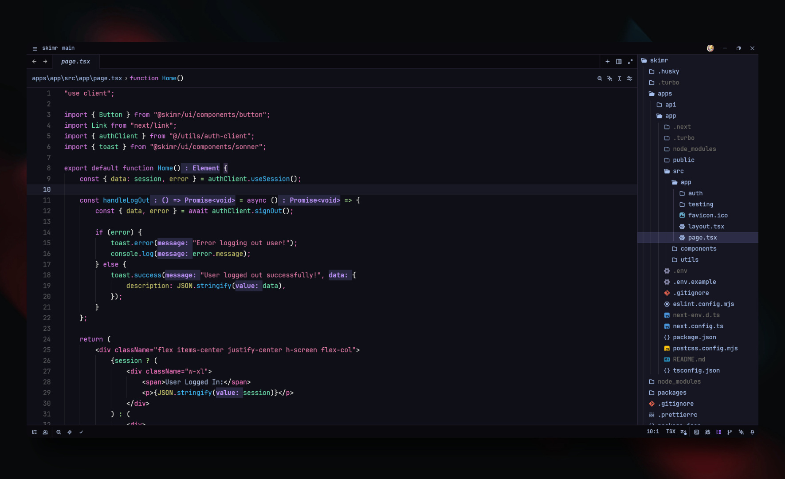

# JoyBoy Theme for [Zed](https://zed.dev)

> A custom dark theme for [Zed](https://zed.dev), inspired by iconic themes with a unique JoyBoy twist.

> JoyBoy: Demon Child

## About

**JoyBoy Zed** is a personal theme crafted to enhance the visual experience of the Zed editor. It blends aesthetics and usability, focusing on a clean dark interface with expressive colors.

The theme draws inspiration from:

* [Dracula](https://github.com/dracula/zed)
* [Dark Magic Themes](https://github.com/davidsmorais/dark-magic-themes)

## Theme Progress

### Color Theme

- [x] JoyBoy – Demon Child
- [ ] JoyBoy – King of Hell
- [ ] JoyBoy - Hiriluk's Dream
- [ ] JoyBoy - Battle Franky
- [ ] JoyBoy - Cat Burglar

## Installation

See [INSTALL.md](./INSTALL.md) for setup instructions.

## 📜 License

This project is licensed under the [MIT License](./LICENSE).
